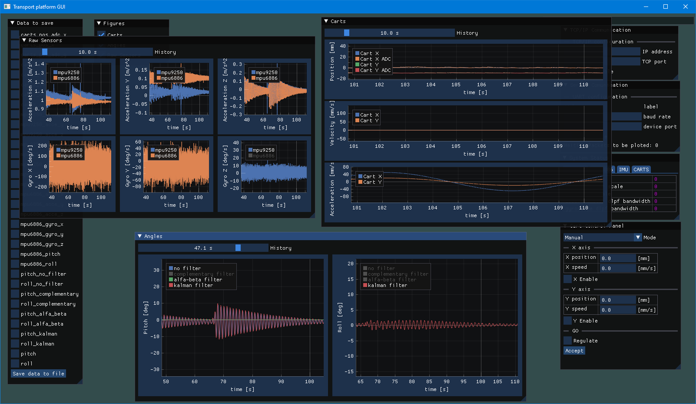

# GUI for transport platform

GUI for platform transport written for my master thesis.
It visualizes in real time actual state and parameters of whole system.

---

## Key Features
* Real time data visulaization
* Data archivization
* Changing states of system
* Stepper motors manual control

---

## Files
* `src/main.cpp` -> window init
* `inc/tcp_client.h` -> tcp client and data storage
* `inc/uart.h` -> uart communictaion and data storage (alternative if tcp client doesn't work)
* `inc/graphs.h` -> data visualization and archivization
* `inc/linmath.h` -> implementation of linear-algebra functions [GLFW linmath.h](https://github.com/glfw/glfw/blob/master/deps/linmath.h)

---

## Tools used
* [Dear ImGui](https://github.com/ocornut/imgui)
* [GLFW](https://github.com/glfw/glfw)
* [GLAD](https://gen.glad.sh/) - library loader for opengl

---

## Instalation

(mingw C++ compiler and make needed)
* Download [Dear ImGui](https://github.com/ocornut/imgui/tree/master/backends) libries for glfw and opengl development
* Generate [GLAD](https://gen.glad.sh/) file from
* Download [GLFW](https://github.com/glfw/glfw) libriers file
* in Makefile change:
    - INCLUDE_DIRS to GLFW and GLAD include path
    - IMGUI_DIR to Dear Imgui include path
* Run make
